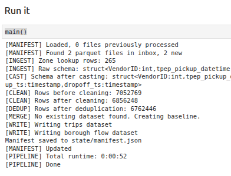
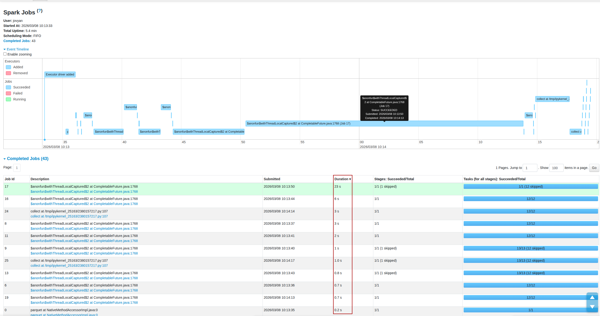
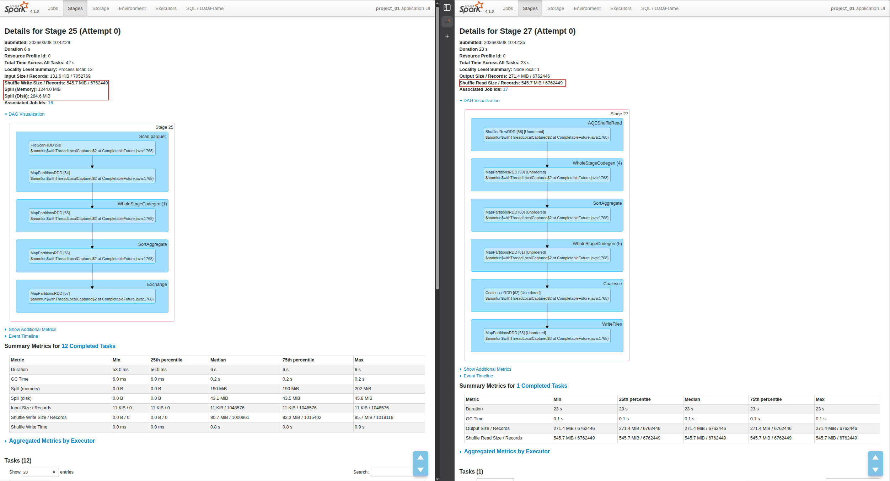
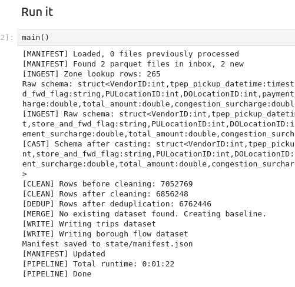
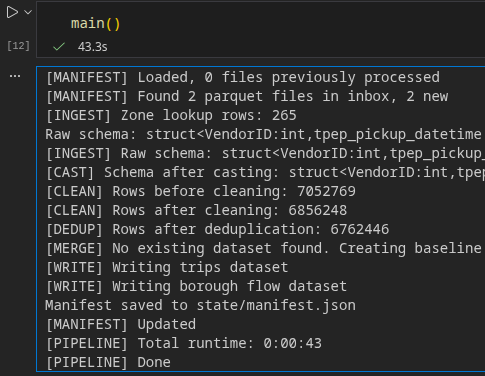
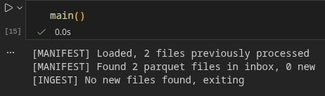
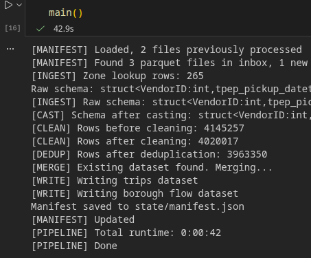

# bigdata26

## Project structure

- Provide the input data (`work/data/inbox/`) before running the pipeline.

```bash
work/data/inbox/
    *.parquet
```

A manifest file is used for saving state (state/manifest.json). It tracks the following:

- which files have been processed;
- file name, path, size in bytes, row count, processed at time
- last run time
- total output rows

## Correctness

### Row counts
| Stage               | Count |
|---------------------|------|
| Input               | 7052769 |
| After cleaning      | 6856248 |
| After deduplication | 6762446 |
| Output              | 6762446 |

### Examples of bad rows

#### 1. Invalid Trip Duration (Remove rows)

Trips where the dropoff timestamp is not later than the pickup timestamp are invalid.


| VendorID | pickup_ts           | dropoff_ts          | trip_distance | total_amount |
| -------- | ------------------- | ------------------- | ------------- | ------------ |
| 1        | 2025-01-01 00:49:48 | 2025-01-01 00:49:48 | 0.0           | 20.06        |

#### 2. Invalid Trip Distance (Remove rows)

Trips with zero or negative trip distance are considered invalid.

| VendorID | pickup_ts           | dropoff_ts          | trip_distance | fare_amount |
| -------- | ------------------- | ------------------- | ------------- | ----------- |
| 2        | 2025-01-01 00:37:43 | 2025-01-01 00:37:53 | 0.0           | 12.0        |


#### 3. Invalid Passenger Count (Replace with NULL)

Passenger counts outside the expected range (1-8) are considered invalid.

| VendorID | pickup_ts           | dropoff_ts          | passenger_count | trip_distance |
| -------- | ------------------- | ------------------- | --------------- | ------------- |
| 1        | 2025-01-01 00:14:47 | 2025-01-01 00:16:15 | 0               | 0.4           |


### Cleaning rules

| # | Rule |
|---|------|
| 1 | Drop rows where any critical field is null: `pickup_ts`, `dropoff_ts`, `PULocationID`, `DOLocationID`, `total_amount` |
| 2 | `dropoff_ts` must be strictly greater than `pickup_ts` |
| 3 | `passenger_count` must be in range 1–8, otherwise set to `NULL` |
| 4 | `trip_distance` must be > 0 |
| 5 | Monetary fields must be ≥ 0, otherwise set to `NULL` |

### Deduplication Rules

Rows are deduplicated on the following business key, which uniquely identifies a taxi trip event:
```python
(VendorID, pickup_ts, dropoff_ts, PULocationID, DOLocationID)
```

## Performance

### Runtime



The full job runs for about 1m on a HP laptop provided by the University.

### Spark Web UI screenshots

1. Total job/stage time



2. Shuffle read/write (or spill) for the join or aggregation stage




### Optimization choices

What did we try, what changed?

1. Broadcasting the lookup table in the join. We compared the impact of a Broadcast Join against a standard Shuffle Join and observed basically no difference in local runtime (both around 50s). 
It's benefits might be probably seen in a multi-node setup, where the network overhead would have had negative impact on standard shuffle join performance. 
2. Removing unnecessary columns from data *in the beginning, during ingestion phase*, which lightened the processing load for the entire pipeline. This change cut the total execution time around 20s. By removing unused fields early, we ensured the cleaning and merging steps operated only on relevant data.
Screenshot of performance without removing unnecessary columns (can be compared to the performance screenshot above) : 


## Custom Scenario

In addition to the enriched trip dataset, the pipeline produces an aggregated view of taxi flows between boroughs.

The dataset `borough_flows.parquet` summarizes trips by:

- `pickup_borough`
- `dropoff_borough`
- `pickup_year_month`

For each borough pair and month the pipeline computes:

- `trip_count` – total number of trips
- `avg_trip_distance` – average trip distance

Example observation: the dominant flow in the dataset is **Manhattan → Manhattan** with more than 2.8 million trips which indicates that most yellow taxi trips occur within Manhattan rather than between boroughs.

## Example runs

1. First run with initial input files `yellow_tripdata_2025-01` and `yellow_tripdata_2025-02`




2. Second run with same files in inbox




3. Third run with a new file `yellow_tripdata_2025-03` (process only the new file)


